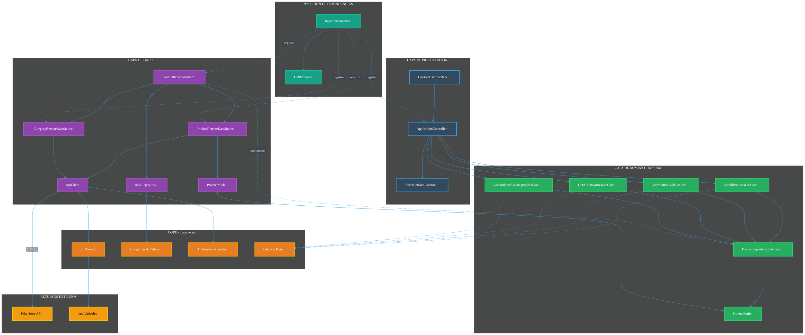
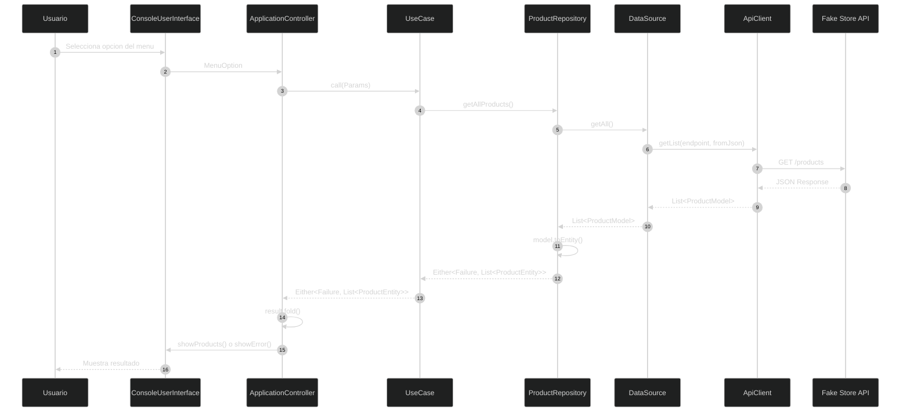
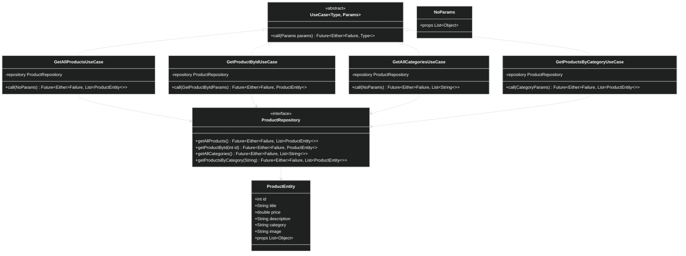
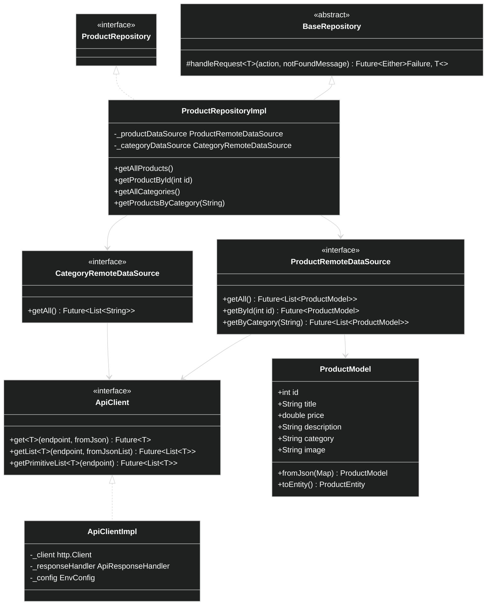
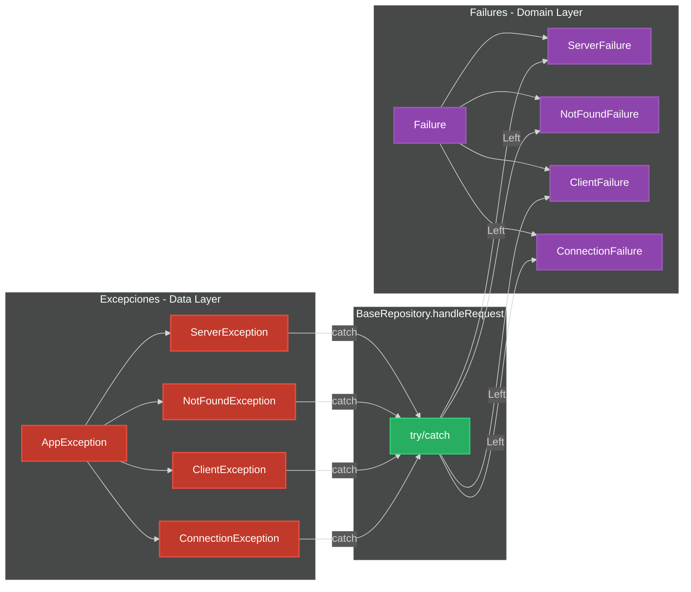
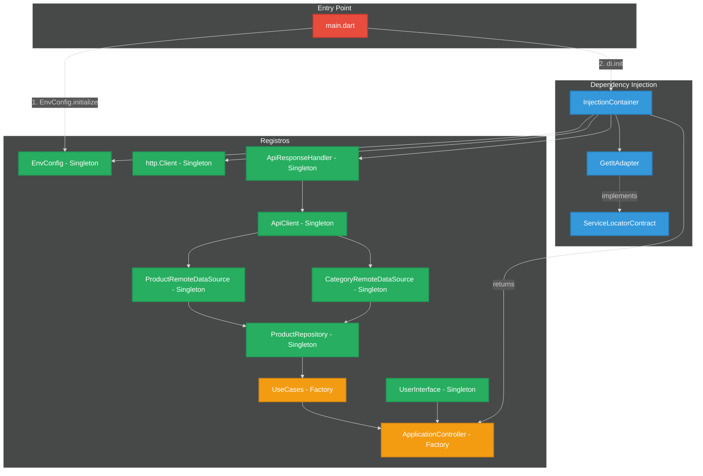
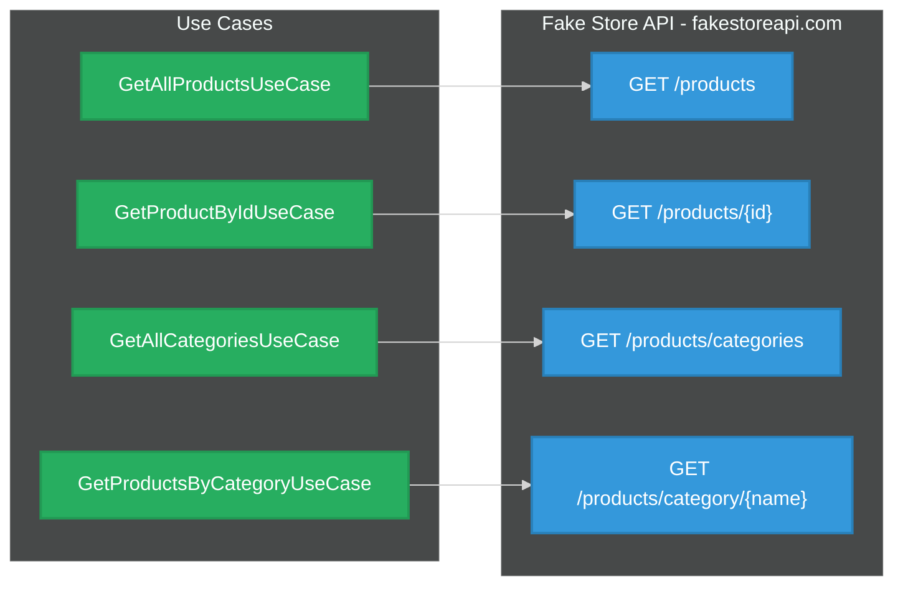

# Diagrama de Arquitectura - Fake Store CLI

**Proyecto:** fase_2_consumo_api
**Tipo:** Aplicacion CLI en Dart
**Arquitectura:** Clean Architecture (3 capas)
**API Externa:** https://fakestoreapi.com

---

## Vista Interactiva

Para visualizar los diagramas:
1. Instala la extension **Mermaid Preview** en VS Code
2. O usa [Mermaid Live Editor](https://mermaid.live)

---

## 1. Diagrama de Arquitectura General



---

## 2. Diagrama de Flujo de Datos



---

## 3. Diagrama de Clases - Domain Layer



---

## 4. Diagrama de Clases - Data Layer



---

## 5. Diagrama de Errores y Failures



---

## 6. Diagrama de Inyeccion de Dependencias



---

## 7. Estructura de Directorios

```
lib/src/
|-- core/                          # Transversal
|   |-- config/                    # EnvConfig, DotenvReader
|   |-- constants/                 # ApiEndpoints
|   |-- errors/                    # Exceptions & Failures
|   |-- network/                   # ApiResponseHandler
|   |-- usecase/                   # UseCase base, NoParams
|
|-- data/                          # Capa de Datos
|   |-- datasources/
|   |   |-- core/                  # ApiClient
|   |   |-- product/               # ProductRemoteDataSource
|   |   |-- category/              # CategoryRemoteDataSource
|   |-- models/                    # ProductModel
|   |-- repositories/              # ProductRepositoryImpl
|
|-- domain/                        # Capa de Dominio (Dart Puro)
|   |-- entities/                  # ProductEntity
|   |-- repositories/              # ProductRepository (interface)
|   |-- usecases/                  # 4 UseCases
|
|-- presentation/                  # Capa de Presentacion
|   |-- adapters/                  # ConsoleUserInterface
|   |-- contracts/                 # UserInterface, MenuOption
|   |-- application.dart           # ApplicationController
|
|-- di/                            # Inyeccion de Dependencias
|   |-- adapters/                  # GetItAdapter
|   |-- contracts/                 # ServiceLocatorContract
|   |-- injection_container.dart
|
|-- util/                          # Utilidades
    |-- strings.dart               # AppStrings
```

---

## 8. Endpoints de la API



---

## Caracteristicas Clave del Sistema

| Caracteristica | Implementacion |
|----------------|----------------|
| **Arquitectura** | Clean Architecture (3 capas) |
| **Patron de Errores** | Either<Failure, T> con dartz |
| **Inyeccion de Dependencias** | get_it con abstraccion |
| **Seguridad** | Variables de entorno en .env |
| **Testing** | 170 tests con patron AAA |
| **Documentacion** | Doc comments con /// |
| **Principios** | SOLID, DRY, YAGNI |

---

## Flujo de Datos Resumido

1. **Usuario** selecciona opcion en CLI
2. **ApplicationController** invoca el UseCase correspondiente
3. **UseCase** llama al Repository (interface)
4. **Repository** delega a DataSource
5. **DataSource** usa ApiClient para HTTP
6. **ApiClient** comunica con Fake Store API
7. **Respuesta** fluye de regreso transformando Model -> Entity
8. **Either** maneja exito (Right) o error (Left)
9. **UI** muestra resultado al usuario

---

*Generado automaticamente por el generador de diagramas Mermaid*
*Fuente: arquitectura-all-diagram-mermaid.md*
